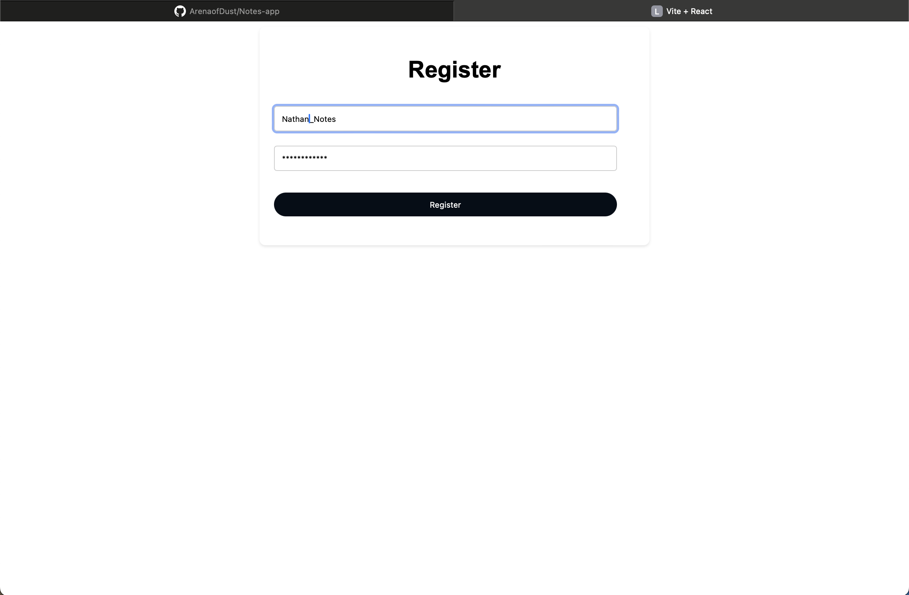
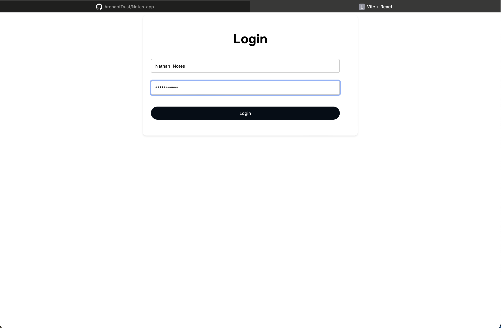
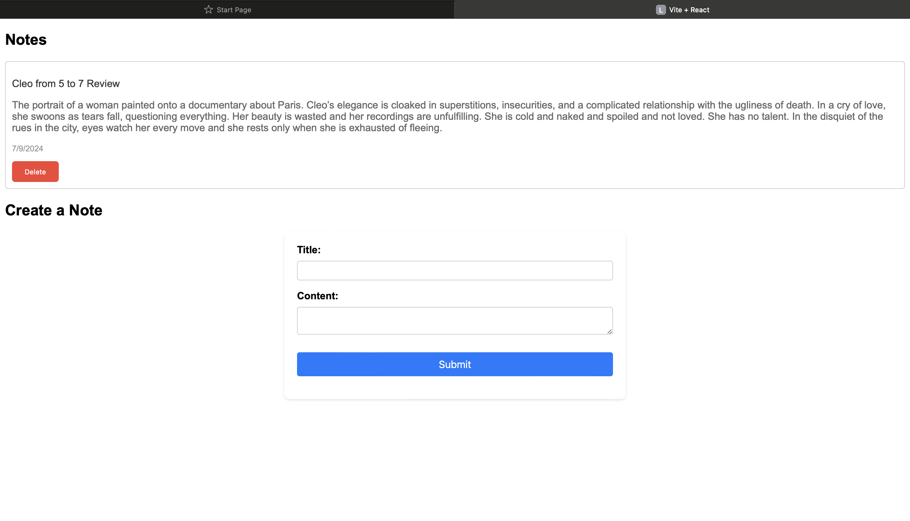

# Full-Stack Notes Application with Python and JavaScript

## Introduction

This project allowed me to learn how to create a full-stack web application using Python and JavaScript utilizing:

- Backend development with Django
- Frontend development with React
- Authentication implementation using JWT tokens
- Deployment of the application (Free Tier)

## Screenshots
- Screenshot 1: Register Page

- Screenshot 2: Login Page

- Screenshot 3: Notes Page

